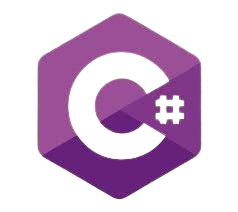

  <h1 align="center">シluiz filipeシ</h1>
  
👋 Tech enthusiast passionate about coding, automation, and data. Working with Python, Javascript, C#, PHP and exploring full-stack development. Always learning and building new things!

  <h5></h5>

  <h2>Principais Tecnologias</h2>
    
    
    
    
    
    

